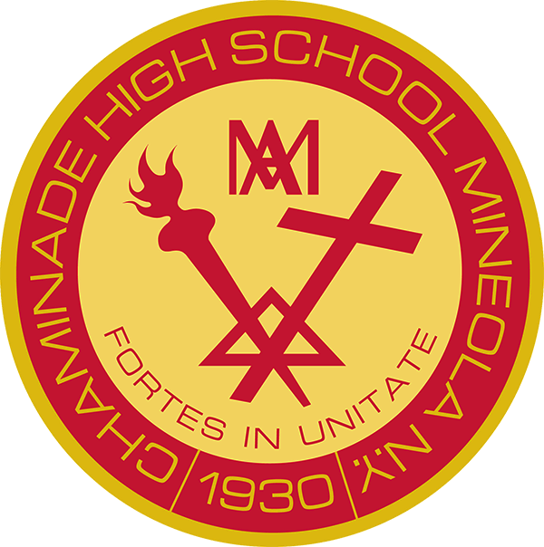

# Chaminade Career Night

List of resources and notes for Chaminade career night presentation

### Presentation
[Link here](https://docs.google.com/presentation/d/1fxJeBdrgY9dRv8lhPmg8hIWGgIGhDrXT4Q7lux5yLn0/edit?usp=sharing)

### Learning Resources
#### General Career and Coding Resources
* [Free Code Camp](https://github.com/freeCodeCamp/freeCodeCamp)
* [Developer Roadmaps](https://roadmap.sh/)
* [Online Programming Books](https://ebookfoundation.github.io/free-programming-books/)
* [Awesome Lists of awesome resources](https://github.com/sindresorhus/awesome)

#### Computer Science Theory
* [Open Source Society University Computer Science](https://github.com/ossu/computer-science)
* [MIT's OpenCourseWare](https://ocw.mit.edu/)
* [Coding Interview University](https://github.com/jwasham/coding-interview-university)